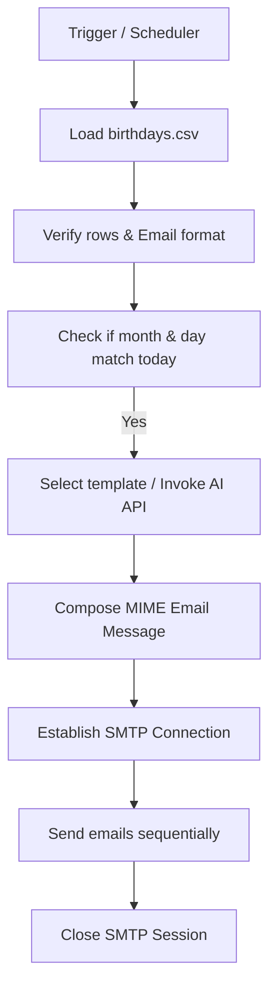

# Ramanans Birthday Bot

[](https://github.com/ramanan-2735/Ramanans-Birthday-Bot-/actions/workflows/python-ci.yml)
[](https://opensource.org/licenses/MIT)

A Python automation service that runs periodically, loads a list of birthdays from a CSV spreadsheet, checks for matches on the current date, generates personalized greetings via template text or generative AI APIs, and dispatches them via SMTP mail connections.

---

## 🚀 Key Features

- **Automated Scheduler & Detection:** Matches local calendar dates against a CSV spreadsheet of birth dates.
- **Dynamic Letter Templating:** Chooses randomly from a folder of markdown/text-based letter templates, replacing variables like `[NAME]` dynamically.
- **Generative AI Custom Messages:** Optionally calls LLM/AI APIs to write tailor-made greetings on the fly.
- **SMTP Connection Pool:** Reuses a single authenticated mail server socket session to dispatch multiple emails sequentially, saving handshake times.
- **Robust Field Validation:** Built-in validation rules for CSV input integrity, email formatting, and date constraints.

---

## 🛠️ Tech Stack

- **Language:** Python 3.9+
- **Data Preprocessing:** Pandas
- **APIs & Networking:** Requests (AI API integrations), SMTPLib (email protocols)
- **Environment Variables:** Python-Dotenv

---

## 📐 Pipeline Flow



---

## 📁 Repository Directory Structure

```
Ramanans-Birthday-Bot-/
├── birthday-wisher-normal-start/
│   ├── letter_templates/     # Directory containing letter templates
│   │   ├── letter_1.txt
│   │   ├── letter_2.txt
│   │   └── letter_3.txt
│   ├── birthdays.csv         # Database sheet of names, emails, and birth dates
│   └── main.py               # Main automation script execution
├── .env.example              # Template environment variables
├── requirements.txt          # Python packages list
└── .gitignore                # Git exclusions
```

---

## ⚙️ Installation & Usage

### 1. Clone the Repository
```bash
git clone https://github.com/ramanan-2735/Ramanans-Birthday-Bot-.git
cd Ramanans-Birthday-Bot-
```

### 2. Install Dependencies
```bash
pip install -r requirements.txt
```

### 3. Setup Configurations
Copy `.env.example` to `.env` and fill out your SMTP mail credentials:
```env
SMTP_SERVER=smtp.gmail.com
SMTP_PORT=587
SENDER_EMAIL=your_email@gmail.com
SENDER_PASSWORD=your_app_specific_password
```

### 4. Running the Bot
Execute the script to scan and wish contacts:
```bash
python birthday-wisher-normal-start/main.py
```

---

## 📄 License

Licensed under the MIT License. See [LICENSE](LICENSE) for details.
